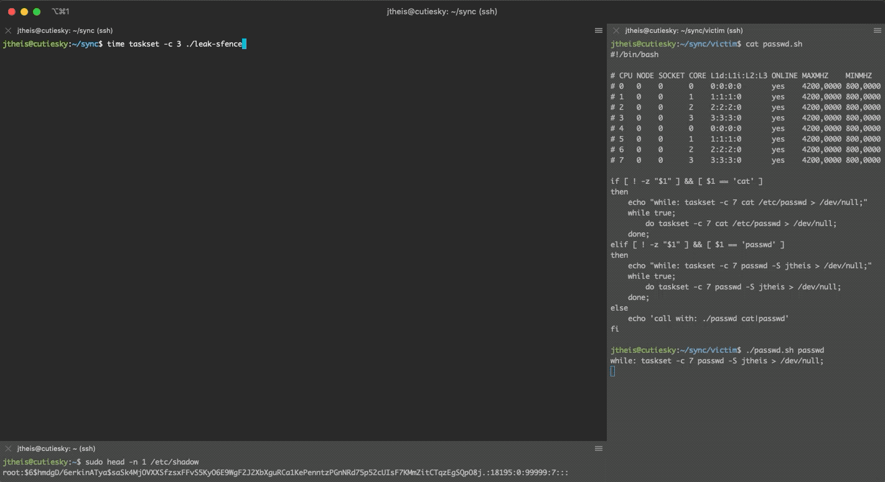

# RIDL on steroids


## Prerequisites
- To run the exploit the processor needs to support [TSX/RTM](https://en.wikipedia.org/wiki/Transactional_Synchronization_Extensions). Check with `lscpu | grep rtm`.
- Victim and exploit need to run on the same core on distinct hyperthreads. To get an overview of logical  and physical cores use `lscpu -e`.
- Huge pages. Check with `/sys/kernel/mm/transparent_hugepage/enabled` and `/proc/sys/vm/nr_hugepages`. Probably you need to run something like the following:

```
echo 16 | sudo tee /proc/sys/vm/nr_hugepages
```

## How to run
```bash
# terminal window 0
make
taskset -c "logical core" ./leak

# terminal window 1
./passwd.sh "logical core"
```

## Acknowledgments
[RIDL-and-ZombieLoad](https://github.com/pietroborrello/RIDL-and-ZombieLoad) by pietroborrello
